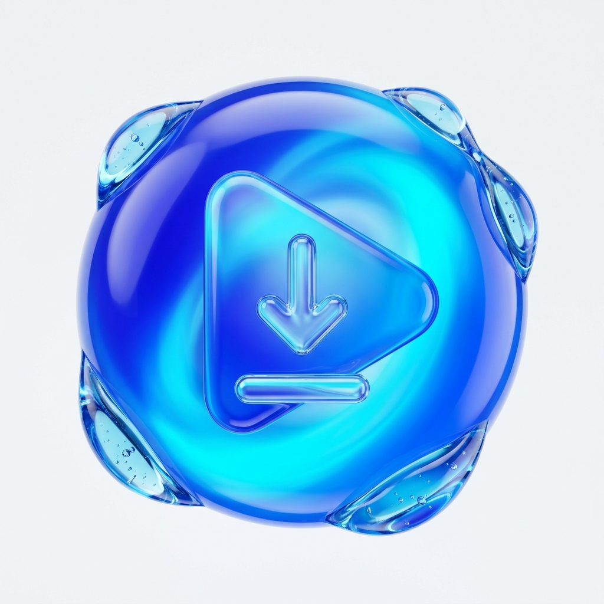

<div align="center">


# LinkFlow — Liquid-Glass Media Downloader for Android

**High-Performance Multi-Pipeline Video (MP4 / WebM) & Audio (MP3 / M4A / WAV) Stream Inspector and Download Engine**

[](LICENSE)
[-2563EB.svg?style=for-the-badge)](#)
[](#)
[](#)

</div>

---

## Overview

**LinkFlow** is a production-grade native Android application crafted with **Kotlin** and **Jetpack Compose (Material 3)** for inspecting, resolving, downloading, and playing **MP4/WebM video** and **MP3/M4A/WAV audio** streams. Designed around a custom **VisionOS-inspired Liquid-Glass** aesthetic, LinkFlow combines multi-pipeline stream extraction, SSRF-hardened networking, atomic byte-stream downloads with HTTP `Range` pause/resume, and an integrated media library.

---

## Visual Gallery & UI Highlights

| Liquid-Glass Studio Emblem | Empty Download Queue Artwork | Media Library Visual Artwork |
| :---: | :---: | :---: |
|  |  |  |
| *3D Cobalt-Blue Liquid-Glass Orb* | *Downloads Queue Empty-State Illustration* | *Media Library Empty-State Illustration* |

---

## Key Features & Capabilities

### 1. Multi-Pipeline Media Analyzer (`MediaAnalyzerEngine.kt`)
- **Direct Media & Open-CDN Inspection**: Performs real HTTP `HEAD` and `Range: bytes=0-0` probes to verify `Content-Type`, `Content-Length`, `Accept-Ranges`, and container signatures before queuing any transfer.
- **YouTube Video & Audio Resolution**: Accurately detects `youtube.com/watch`, `youtu.be`, `youtube.com/shorts`, and share links (`11`-character video ID validation). Resolves playable **MP4** (1080p, 720p, 480p, 360p) and **M4A/MP3** (128kbps – 320kbps) streams via a 4-stage pipeline (*InnerTube Android VR / iOS / Android TestSuite -> Piped API -> Invidious API -> Cobalt*) with automatic fallback to official **YouTube oEmbed / Data API v3** metadata and one-tap **Open in YouTube**.
- **Social & Open-Archive Adapters**:
  - **Internet Archive (`archive.org/details/<id>`)**: Queries the official Metadata API to list all available MP4 derivatives and MP3/FLAC/OGG audio bitrates.
  - **Instagram, Facebook, TikTok, X/Twitter, Reddit, Vimeo, SoundCloud & Dailymotion**: Multi-layer OpenGraph, JSON-LD, embedded player config, and oEmbed resolution with automatic CDN failover.
- **SSRF & Network Hardening**: Blocks loopback (`localhost`, `127.0.0.1`, `::1`), link-local (`169.254.x.x`), and private RFC-1918 (`10.x.x.x`, `172.16-31.x.x`, `192.168.x.x`) addresses both on initial input and across every HTTP redirect hop.

### 2. Atomic Byte-Stream Download Engine (`DownloadQueueManager.kt` & `MediaDownloadWorker.kt`)
- **Resumable HTTP Streaming**: Uses `OkHttpClient` with `Range: bytes=<offset>-` headers and server `206 Partial Content` verification for reliable pause and resume.
- **HTML & Error Page Guard**: Rejects `text/html` error pages or captive portals masquerading as `.mp4` or `.mp3` files by inspecting both HTTP headers and initial magic bytes (`<!DOCTYPE html`, `<html`).
- **Genuine Audio Extraction (`MediaExtractor` & `MediaMuxer`)**: Never renames an `.mp4` container to `.mp3`. When audio extraction is requested from an MP4 source, LinkFlow demuxes the genuine AAC audio track (`audio/mp4a-latm`) into a clean `.m4a` container or streams verified `.mp3` / `.wav` audio directly.
- **Scoped Storage & MediaStore Integration**: Writes to a safe `.part` temporary file, atomically renames upon completion, and publishes finished media to Android `MediaStore` (`Movies/LinkFlow` or `Music/LinkFlow`).
- **Background WorkManager Execution**: Continues active transfers across configuration changes and backgrounding via `MediaDownloadWorker`.

### 3. Premium Liquid-Glass User Experience
- **Animated Splash Screen**: 3D cobalt-blue liquid-glass orb with rotating luminous rings, radial light rays, floating bokeh particles, and reduced-motion accessibility support.
- **Dynamic Quality Bottom Sheet**: Displays real resolution badges (`4K`, `1080p HD`, `720p HD`, `360p`), audio bitrates (`320kbps`, `192kbps`, `128kbps`), container formats, and server-reported file sizes.
- **Built-In Media Library & Player**: Grid and List layouts, search, format filtering, sorting, file renaming, `FileProvider` sharing, and native video/audio playback.

---

## Supported Formats & Sources Matrix

| Source / Platform | Supported URL Patterns | Video Formats | Audio Formats | Resolution & Bitrate Discovery |
| :--- | :--- | :--- | :--- | :--- |
| **Direct HTTPS Media** | Any direct `.mp4`, `.webm`, `.mp3`, `.m4a`, `.wav` link | `MP4`, `WEBM` | `MP3`, `M4A`, `WAV` | Exact `Content-Length` & `Accept-Ranges` |
| **YouTube** | `youtube.com/watch`, `youtu.be/*`, `youtube.com/shorts/*` | `MP4` (360p – 1080p+) | `M4A`, `MP3` (128k – 320k) | Multi-pipeline stream list + oEmbed / Data API v3 |
| **Internet Archive** | `archive.org/details/*`, `archive.org/download/*` | `MP4` | `MP3`, `M4A`, `WAV` | Official Archive.org Metadata JSON API |
| **Instagram / Facebook** | `instagram.com/reel/*`, `facebook.com/watch/*`, `fb.watch/*` | `MP4` | `M4A`, `MP3` | Embedded JSON / OpenGraph / Multi-CDN |
| **TikTok / Vimeo / X** | `tiktok.com/*`, `vimeo.com/*`, `x.com/*`, `twitter.com/*` | `MP4` | `M4A`, `MP3` | Player Config / Syndication / oEmbed |

---

## Architecture & Repository Structure

```text
├── .github/workflows/
│   └── android-ci.yml                          # GitHub Actions CI for unit tests & APK build
├── .env.example                                # Environment variable template (YOUTUBE_DATA_API_KEY)
├── LICENSE                                     # MIT License + Third-Party Open-Source Notices
├── NOTICE                                      # SPDX Attribution & Notice summary
├── README.md                                   # Project documentation
├── app/
│   ├── build.gradle.kts                        # App module Gradle configuration
│   └── src/
│       ├── main/
│       │   ├── AndroidManifest.xml             # Permissions, Share Target & FileProvider setup
│       │   ├── java/com/example/
│       │   │   ├── MainActivity.kt             # Edge-to-edge host, navigation & Share intent handler
│       │   │   ├── data/
│       │   │   │   ├── local/
│       │   │   │   │   ├── Entities.kt                   # Room entities (DownloadTaskEntity, RecentAnalysisEntity)
│       │   │   │   │   ├── LinkFlowDatabase.kt           # Room DAO & SQLite database singleton
│       │   │   │   │   └── PreferencesRepository.kt      # Jetpack DataStore user preferences
│       │   │   │   ├── model/
│       │   │   │   │   └── MediaModels.kt                # Domain models, state machine enum, quality options
│       │   │   │   └── service/
│       │   │   │       ├── DownloadQueueManager.kt       # Coroutine OkHttp byte-stream downloader & MediaStore publisher
│       │   │   │       ├── MediaAnalyzerEngine.kt        # URL validation, SSRF guard & multi-provider stream engine
│       │   │   │       ├── MediaDownloadWorker.kt        # AndroidX WorkManager background download worker
│       │   │   │       ├── OtaUpdateManager.kt           # GitHub Releases OTA update checker & APK installer
│       │   │   │       └── ProviderAdapterArchitecture.kt # Pluggable provider registry & SSRF DNS validator
│       │   │   ├── ui/
│       │   │   │   ├── LinkFlowViewModel.kt              # Reactive MVVM state holder & queue coordinator
│       │   │   │   ├── components/
│       │   │   │   │   └── LiquidGlassComponents.kt      # Reusable glass cards, pull-to-refresh, bottom nav
│       │   │   │   ├── screens/
│       │   │   │   │   ├── ActiveDownloadProgressModal.kt # Full-screen liquid-glass progress ring modal
│       │   │   │   │   ├── DownloadsQueueScreen.kt        # Active/Queued/Completed/Failed download manager
│       │   │   │   │   ├── HomeScreen.kt                  # Hero banner, smart URL bar, preview & format selector
│       │   │   │   │   ├── LibraryScreen.kt               # Media library & native VideoView/MediaPlayer modal
│       │   │   │   │   ├── OtaUpdateDialog.kt             # Liquid-glass OTA update & changelog modal
│       │   │   │   │   ├── QualitySelectorSheet.kt        # Dynamic resolution & audio bitrate bottom sheet
│       │   │   │   │   ├── SettingsAndInfoScreens.kt      # Settings, Supported Sources, Privacy, License & About
│       │   │   │   │   └── SplashScreen.kt                # Animated 3D liquid-glass splash screen
│       │   │   │   └── theme/
│       │   │   │       ├── Color.kt                      # Midnight obsidian & liquid-glass palette tokens
│       │   │   │       ├── Theme.kt                      # LinkFlowTheme & CompositionLocal design tokens
│       │   │   │       └── Type.kt                       # Space Grotesk, Plus Jakarta Sans & JetBrains Mono
│       │   │   └── util/
│       │   │       └── FormatUtils.kt                    # Byte/speed/ETA formatting & FileProvider intents
│       │   └── res/                                      # Generated artwork, adaptive icons, fonts & XML paths
│       └── test/java/com/example/
│           ├── ExampleUnitTest.kt                        # JVM unit tests for URL validation, SSRF & formatting
│           └── ExampleRobolectricTest.kt                 # 15-scenario end-to-end Robolectric & mock-HTTP suite
├── build.gradle.kts                            # Root Gradle configuration
├── gradle/libs.versions.toml                   # Centralized dependency version catalog
└── settings.gradle.kts                         # Project settings (rootProject.name = "LinkFlow")
```

---

## Getting Started: Build, Test & Run

### Prerequisites
- **JDK 17** or newer
- **Android SDK** (`compileSdk = 36`, `minSdk = 24`)

### 1. Optional API Key Configuration
LinkFlow works out of the box with zero configuration. To optionally enrich YouTube metadata previews with official **YouTube Data API v3** ISO-8601 durations and license metadata:
1. Copy `.env.example` or open the **Secrets panel in AI Studio**.
2. Add your `YOUTUBE_DATA_API_KEY` (injected safely at build time via `BuildConfig.YOUTUBE_DATA_API_KEY`).

### 2. Build & Verification Commands
- **Compile Debug APK**:
  ```bash
  gradle :app:assembleDebug
  ```
- **Execute Unit & 15-Scenario Robolectric Test Suite**:
  ```bash
  gradle :app:testDebugUnitTest
  ```
- **Run Android Lint Checks**:
  ```bash
  gradle :app:lintDebug
  ```

---

## License & Open-Source Notices

```text
MIT License
SPDX-License-Identifier: MIT
Copyright (c) 2026 LinkFlow Contributors
```

This project is licensed under the **MIT License** — see the [LICENSE](LICENSE) and [NOTICE](NOTICE) files for full legal terms and third-party attributions:

- **AndroidX, Jetpack Compose, Room, DataStore, WorkManager & MediaMuxer**: Licensed under the [Apache License 2.0](https://www.apache.org/licenses/LICENSE-2.0).
- **Square OkHttp 4 & Coil Compose**: Licensed under the [Apache License 2.0](https://www.apache.org/licenses/LICENSE-2.0).
- **Kotlin Standard Library, Coroutines & Serialization**: Licensed under the [Apache License 2.0](https://www.apache.org/licenses/LICENSE-2.0).
- **Space Grotesk, Plus Jakarta Sans & JetBrains Mono**: Licensed under the [SIL Open Font License 1.1](https://scripts.sil.org/OFL).

### Authorized Media & Compliance Notice
LinkFlow is intended strictly for downloading and managing media that you own, have explicit permission from the rights holder to download, or that is distributed under open licenses (Creative Commons, Public Domain, or open archival collections). Users are solely responsible for adhering to applicable copyright laws and platform Terms of Service.
